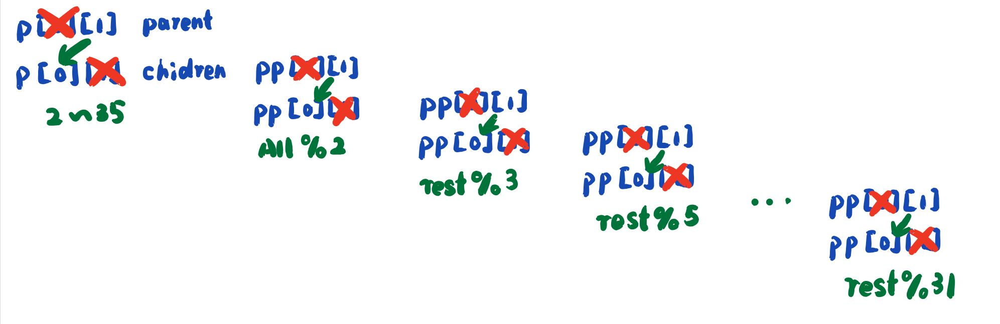
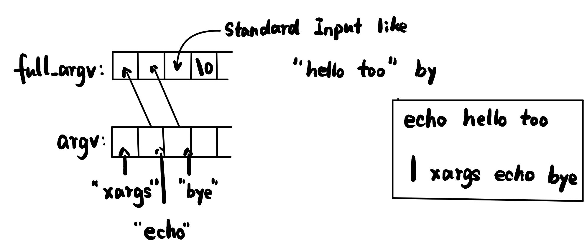

## Environment  

`git clone git://g.csail.mit.edu/xv6-labs-2020`  
`cd xv6-labs-2020`  
`git checkout util`  

To install toolchain:  
`sudo apt-get install git build-essential gdb-multiarch qemu-system-misc gcc-riscv64-linux-gnu binutils-riscv64-linux-gnu`  


## Sleep

Create a file named "sleep.c" in user.  
Just like: xv6-labs-2020/user/sleep.c  

Code:
```c
#include "kernel/types.h"
#include "kernel/stat.h"
#include "user/user.h"

int 
main(int argc, char *argv[])
{
    int duration;
    if(argc<=1){
        fprintf(2,"Require more parameters!");
        exit(1);
    }
    duration = atoi(argv[1]);
    sleep(duration);
    exit(0);
}
```  

Do not forget to add this to your Makefile:
`$U/_sleep\`  
at line 152.  

### Test 
`make qemu`  
`sleep 10`  
It will stop for a little while.  

If it's all set, then run `make grade` to see if it's correct.  

If you get error like this:  

`/usr/bin/env: ‘python’: No such file or directory`  
`make: *** [Makefile:233: grade] Error 127`  

Your machine may not include python2, try:  
`sudo apt-get install python`  

Then `make grade`, it will print your results as follows:  
```
== Test sleep, no arguments == 
$ make qemu-gdb
sleep, no arguments: OK (4.7s) 
== Test sleep, returns == 
$ make qemu-gdb
sleep, returns: OK (0.8s) 
== Test sleep, makes syscall == 
$ make qemu-gdb
sleep, makes syscall: OK (0.9s) 
== Test pingpong == 
$ make qemu-gdb
pingpong: FAIL (1.0s) 
    
Score: 20/100
```

## PingPong 

This is to write a program to teach how to use pipe(), fork().  

Create a file named "pingpong.c" in user.  
And then add these code to the file:  

```c
#include "kernel/types.h"
#include "kernel/stat.h"
#include "user/user.h"

int main(int argc, char** argv){
    int p[2];
    int pid;
    char content;
    if(argc>1){
        printf("Usage: pingpong\n");
        exit(1);
    }
    pipe(p);
    if(fork()==0){
        pid = getpid();
        read(p[0],&content,1);
        close(p[0]);
        printf("%d: received ping\n", pid);
        write(p[1], "0", 1);
        close(p[1]);
    }else{
        pid = getpid();
        write(p[1],"0",1);
        close(p[1]);

        wait(0);

        read(p[0],&content,1);
        close(p[0]);
        printf("%d: received pong\n", pid);
    }
    exit(0);
}
```  

Add this snippet to Makefile:  
`$U/_pingpong\` just below the sleep.   
`make qemu`   
`pingpong`  
```shell
xv6 kernel is booting

hart 1 starting
hart 2 starting
init: starting sh
$ pingpong
4: received ping
3: received pong
$ QEMU: Terminated
```
`make grade`  
```
== Test pingpong == 
$ make qemu-gdb
pingpong: OK (1.0s) 
    (Old xv6.out.pingpong failure log removed)  

Score: 40/100
make: *** [Makefile:234: grade] Error 1
```  

## Primes  

Concurrent programming to yield primes.  



Create primes.c in user:
```c
#include "kernel/types.h"
#include "kernel/stat.h"
#include "user/user.h"
void children_process(int p[2]){
    int prime;
    int pp[2];
    int num;
    int len;//to figure out the return val of read;

    close(p[1]);
    len = read(p[0],&prime,sizeof(int));
    if(len == 0){
        close(p[0]);
        exit(0);
    }
    printf("prime %d\n", prime);
    pipe(pp);

    if(fork()==0){
        close(p[0]);
        children_process(pp);
    }else{
        close(pp[0]);
        while(1){
            len = read(p[0],&num,sizeof(int));
            if(len == 0)
                break;
            
            if(num%prime !=0)
                write(pp[1],&num,sizeof(int));
        }
        close(p[0]);
        close(pp[1]);
        wait(0);
    }
    exit(0);
}

int main(int argc, char** argv){
    if(argc>1){
        fprintf(2, "Usage: primes");
        exit(1);
    }

    int i;
    int p[2];
    pipe(p);

    if(fork()==0){
        children_process(p);
    }else{
        close(p[0]);
        for(i = 2;i<=35;i++)
            write(p[1],&i,sizeof(int));
        close(p[1]);
        wait(0);
    }
    exit(0);
}
```

Manually add this to Makefile:
`$U/_primes\`  

`make qemu`  
```
xv6 kernel is booting

hart 1 starting
hart 2 starting
init: starting sh
$ primes
prime 2
prime 3
prime 5
prime 7
prime 11
prime 13
prime 17
prime 19
prime 23
prime 29
prime 31
$ QEMU: Terminated
```
`make grade`  
```
== Test primes == 
$ make qemu-gdb
primes: OK (1.0s) 
    (Old xv6.out.primes failure log removed)


== Test time == 
time: FAIL 
    Cannot read time.txt
Score: 60/100
make: *** [Makefile:235: grade] Error 1
```

## Find  

Same as above: 

```c
#include "kernel/types.h"
#include "kernel/stat.h"
#include "user/user.h"
#include "kernel/fs.h"

char*
fmtname(char *path)
{
  char *p;
  // Find first character after last slash.
  for(p=path+strlen(path); p >= path && *p != '/'; p--)
    ;
  p++;
  return p;
}

void find(char* path, char* filename){
    char buf[512],*p;
    int fd;
    struct dirent de;
    struct stat st;
    if((fd = open(path, 0)) < 0){
        fprintf(2, "find: cannot open %s\n", path);
        return;
    }//to open the file.

    if(fstat(fd, &st) < 0){
        fprintf(2, "find: connot stat %s\n", path);
        close(fd);
        return;
    }//to obtain some information about the file.  

    switch(st.type){
        case T_FILE:
            if(strcmp(fmtname(path),filename) == 0)
                printf("%s\n",path);
            break;
            
        case T_DIR:
            if(strlen(path)+1+DIRSIZ+1 > sizeof buf){
                printf("ls: path too long");
                break;
            }
            strcpy(buf, path);
            p = buf+strlen(buf);
            *p++ = '/';

            while(read(fd, &de,sizeof(de)) == sizeof(de)){
                if(de.inum == 0 || strcmp(de.name,".") == 0 || strcmp(de.name,"..") == 0)
                    continue;
                memmove(p, de.name, DIRSIZ);
                p[DIRSIZ] = 0;
                find(buf,filename);
            }
            break;

    }
    close(fd);
}

int main(int argc, char** argv){
    if(argc!=3){
        fprintf(2,"Usage: find directory filename.\n");
        exit(1);
    }
    find(argv[1], argv[2]);
    exit(0);
}
```

```
== Test find, in current directory == 
$ make qemu-gdb
find, in current directory: OK (1.1s) 
== Test find, recursive == 
$ make qemu-gdb
find, recursive: OK (1.1s) 

== Test time == 
time: FAIL 
    Cannot read time.txt
Score: 80/100
make: *** [Makefile:236: grade] Error 1
```

## xargs  

First thing to do is to quickly glance at the usage of xargs:  
[xargs](http://www.ruanyifeng.com/blog/2019/08/xargs-tutorial.html)  

```c
#include "kernel/types.h"
#include "kernel/stat.h"
#include "user/user.h"
#include "kernel/fs.h"
#include "kernel/param.h"

int main(int argc, char *argv[])
{
  char buf[512];
  char* full_argv[MAXARG];
  int i;
  int len;
  if(argc < 2){
    fprintf(2, "usage: xargs your_command\n");
    exit(1);
  }
  
  if (argc + 1 > MAXARG) {
      fprintf(2, "too many args\n");
      exit(1);
  }
  // copy the original args
  // skip the first argument xargs
  for (i = 1; i < argc; i++) {
      full_argv[i-1] = argv[i];
  }
  // full_argv[argc-1] is the extra arg to be filled
  // full_argv[argc] is the terminating zero
  full_argv[argc] = 0;
  while (1) {
      i = 0;
      // read a line
      while (1) {
        len = read(0,&buf[i],1);
        if (len == 0 || buf[i] == '\n') break;
        i++;
      }
      if (i == 0) break;
      // terminating 0
      buf[i] = 0;
      full_argv[argc-1] = buf;
      if (fork() == 0) {
        // fork a child process to do the job
        exec(full_argv[0],full_argv);
        exit(0);
      } else {
        // wait for the child process to complete
        wait(0);
      }
  }
  exit(0);
}
```

A brief picture that tell how the codes run:  


result:  

```shell
xv6 kernel is booting

hart 2 starting
hart 1 starting
init: starting sh
$ echo hello too | xargs echo bye
bye hello to
```

Summary:  

```
== Test sleep, no arguments == 
$ make qemu-gdb
sleep, no arguments: OK (5.7s) 
== Test sleep, returns == 
$ make qemu-gdb
sleep, returns: OK (1.0s) 
== Test sleep, makes syscall == 
$ make qemu-gdb
sleep, makes syscall: OK (0.9s) 
== Test pingpong == 
$ make qemu-gdb
pingpong: OK (1.1s) 
== Test primes == 
$ make qemu-gdb
primes: OK (1.0s) 
== Test find, in current directory == 
$ make qemu-gdb
find, in current directory: OK (1.0s) 
== Test find, recursive == 
$ make qemu-gdb
find, recursive: OK (1.1s) 
== Test xargs == 
$ make qemu-gdb
xargs: OK (1.1s) 
== Test time == 
time: OK 
Score: 100/100
```
