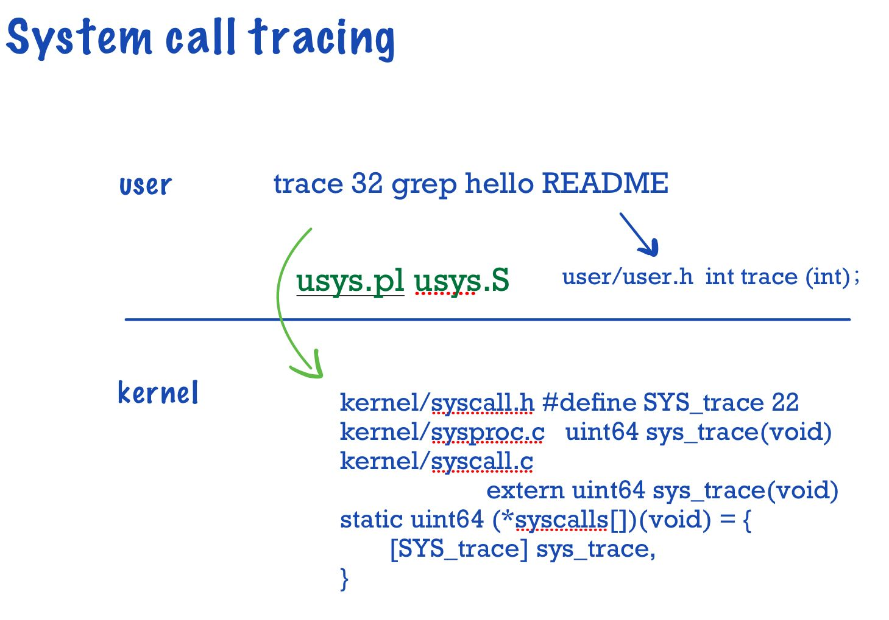

# Lab: system calls  

```
git fetch
git checkout syscall
make clean
```
## System call tracing 

How to add a brand-new system call:



Firstly, add `$U/_trace`to Makefile line 152.  

Then we settle user part:

### user

```c
//user/usys.pl
entry("trace");
```
This would generate usys.S and ecall allows the transformation for user mode into kernel mode.

```c
//user/user.h
int trace(int);
```

### kernel  

```c
//kernel/syscall.h
#define SYS_trace 22
```  

```c  
//kernel/syscall.c
extern uint64 sys_trace(void);

static uint64 (*syscalls[])(void) = {
    //.............
    [SYS_trace]  sys_trace,
}
```

First add this mask property into struct proc:
```c
struct proc {
  //....................
  int mask; 
};
```

```c
//sysproc.c
uint64
sys_trace(void)
{
  int mask;
  if(argint(0, &mask) < 0)
    return -1;
  
  myproc()->mask = mask;
  return 0;
}
```
Now we should set up a mapping from SYS num to string:
```c
char *sysname[] = {
[SYS_fork]    "fork",
[SYS_exit]    "exit",
[SYS_wait]    "wait",
[SYS_pipe]    "pipe",
[SYS_read]    "read",
[SYS_kill]    "kill",
[SYS_exec]    "exec",
[SYS_fstat]   "stat",
[SYS_chdir]   "chdir",
[SYS_dup]     "dup",
[SYS_getpid]  "getpid",
[SYS_sbrk]    "sbrk",
[SYS_sleep]   "sleep",
[SYS_uptime]  "uptime",
[SYS_open]    "open",
[SYS_write]   "write",
[SYS_mknod]   "mknod",
[SYS_unlink]  "unlink",
[SYS_link]    "link",
[SYS_mkdir]   "mkdir",
[SYS_close]   "close",
[SYS_trace]   "trace",
};
```
Then we modify syscall(;)
```c
void
syscall(void)
{
  int num;
  struct proc *p = myproc();

  num = p->trapframe->a7;
  if(num > 0 && num < NELEM(syscalls) && syscalls[num]) {
    p->trapframe->a0 = syscalls[num]();
    //These two lines are new added.
    if((1 << num) & p->mask)
      printf("%d: syscall %s -> %d\n",p->pid, sysname[num], p->trapframe->a0);
    //...
  } else {
    printf("%d %s: unknown sys call %d\n",
            p->pid, p->name, num);
    p->trapframe->a0 = -1;
  }
}
```

To pass Test trace children, we should add 
```c
//kernel/proc.c
np->mask = p->mask;
```

Result:
```
== Test trace 32 grep == 
$ make qemu-gdb
trace 32 grep: OK (4.5s) 
== Test trace all grep == 
$ make qemu-gdb
trace all grep: OK (0.8s) 
== Test trace nothing == 
$ make qemu-gdb
trace nothing: OK (0.7s) 
== Test trace children == 
$ make qemu-gdb
trace children: OK (10.1s) 
```  

## Sysinfo  

As above, we add system call to settle compliation problem:  

```
//Makefile
$U/_sysinfotest
```

```c
//user/user.h
int sysinfo(struct sysinfo*);
```  

```
//user/usys.pl
entry("sysinfo");
```

Kernel:  
```c
//kernel/syscall.h
#define SYS_sysinfo   23
```

```c
//kernel/syscall.c
extern uint64 sys_sysinfo(void);  
static uint64 (*syscalls[])(void) = {
    //.............
    [SYS_sysinfo] sys_sysinfo,
}
```

traverse process array to get the num of process:
```c
//kernel/proc.c
uint64 
free_proc(void){
  uint64 n = 0;
  struct proc* p;
  for(p = proc; p<&proc[NPROC]; p++){
    acquire(&p->lock);
    if(p->state != UNUSED) n++;
    release(&p->lock);
  }
  return n;
}
```
Traverse freelist to get the num of free page, don't forget to multiply PGSIZE.  
```c
//kernel/kalloc.c
uint64 free_mem(void){
  struct run* temp;
  temp = kmem.freelist;
  uint64 n = 0;
  while(temp){
    n++;
    temp = temp->next;
  }  
  return n * PGSIZE;
}
```
Add them all to defs.h 
```c
//defs.h
uint64          free_proc(void);
uint64          free_mem(void);
```

Implement syscall:

```c
uint64
sys_sysinfo(void)
{
  uint64 addr;
  if(argaddr(0,&addr) < 0)
    return -1;
  
  struct sysinfo info;
  struct proc* p = myproc();

  info.freemem = free_mem();
  info.nproc = free_proc();

  if(copyout(p->pagetable, addr, (char *)&info, sizeof(info)) < 0)
      return -1;
  return 0;
}
```
result:

```
== Test sysinfotest == 
$ make qemu-gdb
sysinfotest: OK (2.0s) 
```

Overall:
```
== Test trace 32 grep == 
$ make qemu-gdb
trace 32 grep: OK (4.5s) 
== Test trace all grep == 
$ make qemu-gdb
trace all grep: OK (0.8s) 
== Test trace nothing == 
$ make qemu-gdb
trace nothing: OK (0.7s) 
== Test trace children == 
$ make qemu-gdb
trace children: OK (10.1s) 
== Test sysinfotest == 
$ make qemu-gdb
sysinfotest: OK (2.0s) 
== Test time == 
time: OK 
Score: 35/35
```


