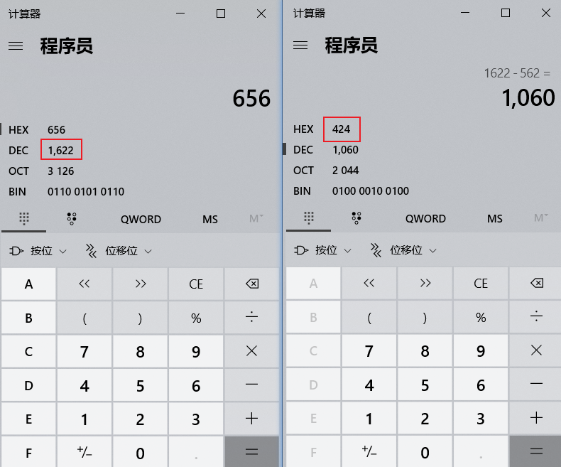
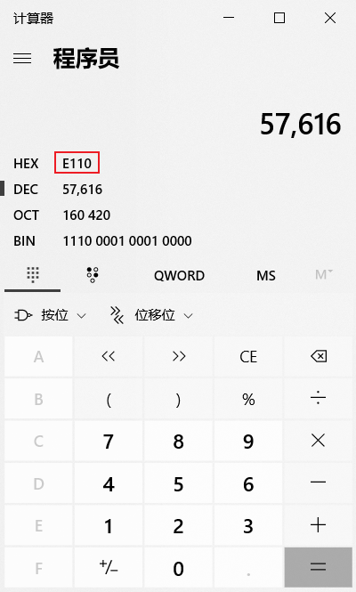
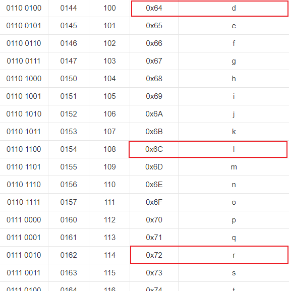
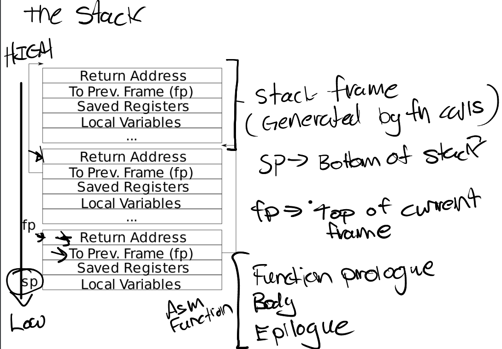
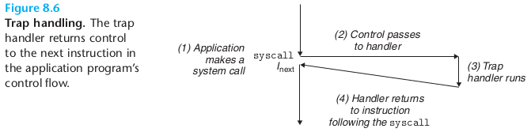

# Lab4 - traps

## RISC-V assembly (easy)

`git checkout traps`

`make clean`

To answer the following question, first do `make fs.img`.

### 1. Which registers contain arguments to functions? For example, which register holds 13 in main's call to printf?

```asm6502
000000000000001c <main>:

void main(void) {
  1c:	1141                	addi	sp,sp,-16
  1e:	e406                	sd	ra,8(sp)
  20:	e022                	sd	s0,0(sp)
  22:	0800                	addi	s0,sp,16
  printf("%d %d\n", f(8)+1, 13);
  24:	4635                	li	a2,13
  26:	45b1                	li	a1,12
```

> since 12 = f(8)+1 = 8+3+1, it may be optimized by compiler and a2 holds 13.
> 
> a1 and a2 holds the arguments to printf(), and a0 holds the argument to g(x).

```asm6502
int g(int x) {
   0:	1141                	addi	sp,sp,-16
   2:	e422                	sd	s0,8(sp)
   4:	0800                	addi	s0,sp,16
  return x+3;
}
   6:	250d                	addiw	a0,a0,3
   8:	6422                	ld	s0,8(sp)
   a:	0141                	addi	sp,sp,16
   c:	8082                	ret

000000000000000e <f>:

int f(int x) {
   e:	1141                	addi	sp,sp,-16
  10:	e422                	sd	s0,8(sp)
  12:	0800                	addi	s0,sp,16
  return g(x);
}
  14:	250d                	addiw	a0,a0,3
  16:	6422                	ld	s0,8(sp)
  18:	0141                	addi	sp,sp,16
  1a:	8082                	ret

```

#### 2. Where is the call to function f in the assembly code for main? Where is the call to g? (Hint: the compiler may inline functions.)

```asm6502
int g(int x) {
   0:	1141                	addi	sp,sp,-16
   2:	e422                	sd	s0,8(sp)
   4:	0800                	addi	s0,sp,16
  return x+3;
}
   6:	250d                	addiw	a0,a0,3
   8:	6422                	ld	s0,8(sp)
   a:	0141                	addi	sp,sp,16
   c:	8082                	ret

000000000000000e <f>:

int f(int x) {
   e:	1141                	addi	sp,sp,-16
  10:	e422                	sd	s0,8(sp)
  12:	0800                	addi	s0,sp,16
  return g(x);
}
  14:	250d                	addiw	a0,a0,3
  16:	6422                	ld	s0,8(sp)
  18:	0141                	addi	sp,sp,16
  1a:	8082                	ret

000000000000001c <main>:

void main(void) {
  1c:	1141                	addi	sp,sp,-16
  1e:	e406                	sd	ra,8(sp)
  20:	e022                	sd	s0,0(sp)
  22:	0800                	addi	s0,sp,16
  printf("%d %d\n", f(8)+1, 13);
  24:	4635                	li	a2,13
  26:	45b1                	li	a1,12
  28:	00000517          	auipc	a0,0x0
  2c:	7b050513          	addi	a0,a0,1968 # 7d8 <malloc+0xea>
  30:	00000097          	auipc	ra,0x0
  34:	600080e7          	jalr	1536(ra) # 630 <printf>
  exit(0);
  38:	4501                	li	a0,0
  3a:	00000097          	auipc	ra,0x0
  3e:	27e080e7          	jalr	638(ra) # 2b8 <exit>
```

> As we can see, there's no corresponding invoking for f and g in main(). Maybe it's already optimzed by compiler to give a single 12 to a1.

#### 3. At what address is the function printf located?

> By searching we can find:

```asm6502
0000000000000630 <printf>:

void
printf(const char *fmt, ...)
{
 630:	711d                	addi	sp,sp,-96
 632:	ec06                	sd	ra,24(sp)
```

> So it's located at 0x630.

#### 4. What value is in the register ra just after the jalr to printf in main?

> AUIPC (add upper immediate to pc) is used to build pc-relative addresses and uses the U-type format. AUIPC forms a 32-bit offset from the U-immediate, filling in the lowest 12 bits with zeros, adds this offset **to the address of the AUIPC instruction**, then places the result in register rd.

> The indirect jump instruction JALR (jump and link register) uses the I-type encoding. The target address is obtained by adding the sign-extended 12-bit I-immediate to the register rs1, then setting the least-significant bit of the result to zero. The address of the instruction following the jump (pc+4) is written to register rd. Register x0 can be used as the destination if the result is not required.

```asm6502
 652:	85aa                	mv	a1,a0
 654:	4505                	li	a0,1
 656:	00000097          	auipc	ra,0x0
 65a:	dce080e7          	jalr	-562(ra) # 424 <vprintf>
}
```

> `auipc ra 0x0` made ra the current address, namely 0x656, jalr made ra add the offset(10-digit) to approach the specified function. Here is 0x424.



> Return address is in ra and it's 0x38.

#### 5. Run the following code.

```
unsigned int i = 0x00646c72;
printf("H%x Wo%s", 57616, &i);
```

What is the output? [Here's an ASCII table](http://web.cs.mun.ca/~michael/c/ascii-table.html) that maps bytes to characters.

The output depends on that fact that the RISC-V is little-endian. If the RISC-V were instead big-endian what would you set `i` to in order to yield the same output? Would you need to change `57616` to a different value?

[Here's a description of little- and big-endian](http://www.webopedia.com/TERM/b/big_endian.html) and [a more whimsical description](http://www.networksorcery.com/enp/ien/ien137.txt).



> To convert 57616, we can already see that its 16-digit form is E110, so the former part is HE110, quite similar to HELLO.



> Due to little-endian, 0x00646c72 get reversed and they are r(0x72), l(0x6C), d(0x64), '\0'(0x00). Putting them together, it's `HE110, World\0`.

#### 6. In the following code, what is going to be printed after `'y='`? (note: the answer is not a specific value.) Why does this happen?

```
printf("x=%d y=%d", 3);
```

> if we rewrite the main() and `make fs.img`.

```c
void main(void) {
  printf("%d %d %d %d %d", 1,2,3,4,5);
  exit(0);
}
```

> It would be like this.

```asm6502
000000000000001c <main>:

void main(void) {
  1c:	1141                	addi	sp,sp,-16
  1e:	e406                	sd	ra,8(sp)
  20:	e022                	sd	s0,0(sp)
  22:	0800                	addi	s0,sp,16
  printf("%d %d %d %d %d", 1,2,3,4,5);
  24:	4795                	li	a5,5
  26:	4711                	li	a4,4
  28:	468d                	li	a3,3
  2a:	4609                	li	a2,2
  2c:	4585                	li	a1,1
  2e:	00000517          	auipc	a0,0x0
  32:	7aa50513          	addi	a0,a0,1962 # 7d8 <malloc+0xe4>
  36:	00000097          	auipc	ra,0x0
  3a:	600080e7          	jalr	1536(ra) # 636 <printf>
  exit(0);
  3e:	4501                	li	a0,0
  40:	00000097          	auipc	ra,0x0
  44:	27e080e7          	jalr	638(ra) # 2be <exit>
```

> What happened in printf:

```asm6502
void
printf(const char *fmt, ...)
{
 636:	711d                	addi	sp,sp,-96
 638:	ec06                	sd	ra,24(sp)
 63a:	e822                	sd	s0,16(sp)
 63c:	1000                	addi	s0,sp,32
 63e:	e40c                	sd	a1,8(s0)
 640:	e810                	sd	a2,16(s0)
 642:	ec14                	sd	a3,24(s0)
 644:	f018                	sd	a4,32(s0)
 646:	f41c                	sd	a5,40(s0)
 648:	03043823          	sd	a6,48(s0)
 64c:	03143c23          	sd	a7,56(s0)
  va_list ap;

  va_start(ap, fmt);
 650:	00840613          	addi	a2,s0,8
 654:	fec43423          	sd	a2,-24(s0)
  vprintf(1, fmt, ap);
 658:	85aa                	mv	a1,a0
 65a:	4505                	li	a0,1
 65c:	00000097          	auipc	ra,0x0
 660:	dce080e7          	jalr	-562(ra) # 42a <vprintf>
}	
```

> Now we look into the vprintf:

```asm6502
void
vprintf(int fd, const char *fmt, va_list ap)
{
  char *s;
  int c, i, state;

  state = 0;
  for(i = 0; fmt[i]; i++){
 448:	0005c903          	lbu	s2,0(a1)
 44c:	18090f63          	beqz	s2,5ea <vprintf+0x1c0>
 450:	8aaa                	mv	s5,a0
 452:	8b32                	mv	s6,a2
```

> a2 is placed at s6.

```asm6502
        printint(fd, va_arg(ap, int), 10, 1);
 4e4:	008b0913          	addi	s2,s6,8
 4e8:	4685                	li	a3,1
 4ea:	4629                	li	a2,10
 4ec:	000b2583          	lw	a1,0(s6)
 4f0:	8556                	mv	a0,s5
 4f2:	00000097          	auipc	ra,0x0
 4f6:	e8e080e7          	jalr	-370(ra) # 380 <printint>
 4fa:	8b4a                	mv	s6,s2
```

> So the first %d is the value of s6 and it extracts 4 bytes.

> When that is over, s6 add itself with 8 to point to the next value.
> 
> So printf("x=%d y=%d", 3); when 3 is printed and the next %d will to be reaching the first address of stack.
> 
> It will print the content of a2, but no one could determine what the previous value of register a2. So the result is undefined.

## Backtrace(Moderate)  

1. Add the prototype for backtrace to kernel/defs.h so that you can invoke backtrace in sys_sleep.

```c
//kernel/defs.h
void            backtrace();
```

2. Add the following function to kernel/riscv.h:

```c
//kernel/riscv.h
static inline uint64
r_fp()
{
  uint64 x;
  asm volatile("mv %0, s0" : "=r" (x) );
  return x;
}
```
3. Implement the function

> Since the stack frame is stored in a PAGESIZE, so we can think of its stack bottom line as PGROUNDUP(fp).  



```c
void backtrace(){
  uint64 fp = r_fp();
  uint64 bottom = PGROUNDUP(fp);
  printf("backtrace:\n");
  while(1){
    if(bottom == fp) break;
    printf("%p\n",*(uint64 *)(fp-8));
    fp = *(uint64*)(fp-16);
  }
}
```

4. Insert the function into sys_sleep:

```c
//kernel/sysproc.c
uint64
sys_sleep(void)
{
  ..................
  backtrace();
  release(&tickslock);
  return 0;
}
```


```shell
xv6 kernel is booting

hart 1 starting
hart 2 starting
init: starting sh
$ bttest
backtrace:
0x0000000080002d1c
0x0000000080002b90
0x000000008000287a
```

```shell
== Test backtrace test == 
$ make qemu-gdb
backtrace test: OK (2.2s) 
== Test running alarmtest == 
$ make qemu-gdb
(1.0s) 
```

## Alarm(hard)

As usual, we should register two system call as what we did in [lab2](../lab2)

```c
int sigalarm(int ticks, void (*handler)());
int sigreturn(void);
```

### test0: invoke handler

we should add two different fields in the struct proc:

```c
struct proc {
  ................
  void (*handler)();
  int alarm_interval;
  int total_ticks;

};
```

Also, we need to initialize the total_ticks variable in `allocproc`:
```c
//kernel/proc.c
static struct proc*
allocproc(void)
{
  ........
found:
  p->pid = allocpid();
  p->total_ticks = 0;
  ........
  return p;
}
```
Now we'll devel into the concrete implementation of two system calls:  

```c
//kernel/sysproc.c
uint64
sys_sigalarm(void)
{
    struct proc* p = myproc();
    int n;
    uint64 handler;

    if(argint(0,&n) < 0)
        return -1;
    if(argaddr(1, &handler) < 0)
        return -1;

    //To fetech variables from a0 and a1 register.

    p->handler = (void (*)())handler;
    p->alarm_interval = n;
    return 0;
}
```

Yet sys_sigreturn just need to `return 0`:

```c
//kernel/sysproc.c
uint64
sys_sigreturn(void)
{
  return 0;
}
```

`which_dev == 2` corresponds to timer_interrupt.  
```c
//kernel/trap.c
if(which_dev == 2){
    p->total_ticks++;
    if(p->total_ticks == p->alarm_interval){
        p->total_ticks = 0;
        p->trapframe->epc = (uint64)p->handler;
    }
    yield();
}
```

### test1/test2(): resume interrupted code

trap from CSAPP:  

This step needs we save and restore some register:

save:
```c
if(which_dev == 2){
    p->total_ticks++;
    if(p->total_ticks == p->alarm_interval){

        p->total_ticks = 0;

        if(p->in_handler == 0){
          p->epc = p->trapframe->epc;
          p->ra = p->trapframe->ra;
          p->sp = p->trapframe->sp;
          p->gp = p->trapframe->gp;
          p->tp = p->trapframe->tp;
          p->t0 = p->trapframe->t0;
          p->t1 = p->trapframe->t1;
          p->t2 = p->trapframe->t2;
          p->s0 = p->trapframe->s0;
          p->s1 = p->trapframe->s1;
          p->a0 = p->trapframe->a0;
          p->a1 = p->trapframe->a1;
          p->a2 = p->trapframe->a2;
          p->a3 = p->trapframe->a3;
          p->a4 = p->trapframe->a4;
          p->a5 = p->trapframe->a5;
          p->a6 = p->trapframe->a6;
          p->a7 = p->trapframe->a7;
          p->s2 = p->trapframe->s2;
          p->s3 = p->trapframe->s3;
          p->s4 = p->trapframe->s4;
          p->s5 = p->trapframe->s5;
          p->s6 = p->trapframe->s6;
          p->s7 = p->trapframe->s7;
          p->s8 = p->trapframe->s8;
          p->s9 = p->trapframe->s9;
          p->s10 = p->trapframe->s10;
          p->s11 = p->trapframe->s11;
          p->t3 = p->trapframe->t3;
          p->t4 = p->trapframe->t4;
          p->t5 = p->trapframe->t5;
          p->t6 = p->trapframe->t6;

          p->trapframe->epc = (uint64)p->handler;
          p->in_handler = 1;
        }    
    }
    yield();
}
```
`in_handler` variable is used to indicate that it's in the handler, not to save register when the handler is launched(until the `sigreturn` is called).

These code is used to restore our register:  

```c
uint64
sys_sigreturn(void)
{
    struct proc* p = myproc();
    p->trapframe->epc = p->epc;
    p->trapframe->ra = p->ra;
    p->trapframe->sp = p->sp;
    p->trapframe->gp = p->gp;
    p->trapframe->tp = p->tp;
    p->trapframe->t0 = p->t0;
    p->trapframe->t1 = p->t1;
    p->trapframe->t2 = p->t2;
    p->trapframe->s0 = p->s0;
    p->trapframe->s1 = p->s1;
    p->trapframe->a0 = p->a0;
    p->trapframe->a1 = p->a1;
    p->trapframe->a2 = p->a2;
    p->trapframe->a3 = p->a3;
    p->trapframe->a4 = p->a4;
    p->trapframe->a5 = p->a5;
    p->trapframe->a6 = p->a6;
    p->trapframe->a7 = p->a7;
    p->trapframe->s2 = p->s2;
    p->trapframe->s3 = p->s3;
    p->trapframe->s4 = p->s4;
    p->trapframe->s5 = p->s5;
    p->trapframe->s6 = p->s6;
    p->trapframe->s7 = p->s7;
    p->trapframe->s8 = p->s8;
    p->trapframe->s9 = p->s9;
    p->trapframe->s10 = p->s10;
    p->trapframe->s11 = p->s11;
    p->trapframe->t3 = p->t3;
    p->trapframe->t4 = p->t4;
    p->trapframe->t5 = p->t5;
    p->trapframe->t6 = p->t6;
    p->in_handler = 0;
    return 0;
}
```

```shell
make grade
== Test answers-traps.txt == answers-traps.txt: OK 
== Test backtrace test == 
$ make qemu-gdb
backtrace test: OK (2.1s) 
== Test running alarmtest == 
$ make qemu-gdb
(4.0s) 
== Test   alarmtest: test0 == 
  alarmtest: test0: OK 
== Test   alarmtest: test1 == 
  alarmtest: test1: OK 
== Test   alarmtest: test2 == 
  alarmtest: test2: OK 
== Test usertests == 
$ make qemu-gdb
usertests: OK (78.8s) 
== Test time == 
time: OK 
Score: 85/85
```

---
```c
//alarmtest.c
//
// test program for the alarm lab.
// you can modify this file for testing,
// but please make sure your kernel
// modifications pass the original
// versions of these tests.
//

#include "kernel/param.h"
#include "kernel/types.h"
#include "kernel/stat.h"
#include "kernel/riscv.h"
#include "user/user.h"

void test0();
void test1();
void test2();
void periodic();
void slow_handler();

int
main(int argc, char *argv[])
{
  test0();
  test1();
  test2();
  exit(0);
}

volatile static int count;

void
periodic()
{
  count = count + 1;
  printf("alarm!\n");
  sigreturn();
}

// tests whether the kernel calls
// the alarm handler even a single time.
void
test0()
{
  int i;
  printf("test0 start\n");
  count = 0;
  sigalarm(2, periodic);
  for(i = 0; i < 1000*500000; i++){
    if((i % 1000000) == 0)
      write(2, ".", 1);
    if(count > 0)
      break;
  }
  sigalarm(0, 0);
  if(count > 0){
    printf("test0 passed\n");
  } else {
    printf("\ntest0 failed: the kernel never called the alarm handler\n");
  }
}

void __attribute__ ((noinline)) foo(int i, int *j) {
  if((i % 2500000) == 0) {
    write(2, ".", 1);
  }
  *j += 1;
}

//
// tests that the kernel calls the handler multiple times.
//
// tests that, when the handler returns, it returns to
// the point in the program where the timer interrupt
// occurred, with all registers holding the same values they
// held when the interrupt occurred.
//
void
test1()
{
  int i;
  int j;

  printf("test1 start\n");
  count = 0;
  j = 0;
  sigalarm(2, periodic);
  for(i = 0; i < 500000000; i++){
    if(count >= 10)
      break;
    foo(i, &j);
  }
  if(count < 10){
    printf("\ntest1 failed: too few calls to the handler\n");
  } else if(i != j){
    // the loop should have called foo() i times, and foo() should
    // have incremented j once per call, so j should equal i.
    // once possible source of errors is that the handler may
    // return somewhere other than where the timer interrupt
    // occurred; another is that that registers may not be
    // restored correctly, causing i or j or the address ofj
    // to get an incorrect value.
    printf("\ntest1 failed: foo() executed fewer times than it was called\n");
  } else {
    printf("test1 passed\n");
  }
}

//
// tests that kernel does not allow reentrant alarm calls.
void
test2()
{
  int i;
  int pid;
  int status;

  printf("test2 start\n");
  if ((pid = fork()) < 0) {
    printf("test2: fork failed\n");
  }
  if (pid == 0) {
    count = 0;
    sigalarm(2, slow_handler);
    for(i = 0; i < 1000*500000; i++){
      if((i % 1000000) == 0)
        write(2, ".", 1);
      if(count > 0)
        break;
    }
    if (count == 0) {
      printf("\ntest2 failed: alarm not called\n");
      exit(1);
    }
    exit(0);
  }
  wait(&status);
  if (status == 0) {
    printf("test2 passed\n");
  }
}

void
slow_handler()
{
  count++;
  printf("alarm!\n");
  if (count > 1) {
    printf("test2 failed: alarm handler called more than once\n");
    exit(1);
  }
  for (int i = 0; i < 1000*500000; i++) {
    asm volatile("nop"); // avoid compiler optimizing away loop
  }
  sigalarm(0, 0);
  sigreturn();
}
```