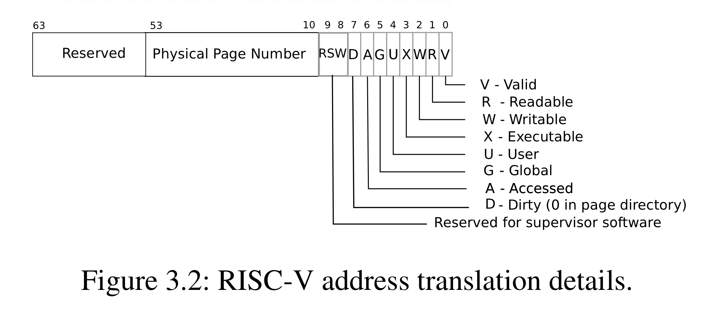

# Lab6 - Copy-on-Write Fork  


## Implement copy-on write(hard)

According to the advise given by the professor, we could manually add a reference count to each page so that we add an array of reference count to kmem:  

```c
//kernel/kalloc.c
struct {
  struct spinlock lock;
  struct run *freelist;
  int rc[PHYSTOP/PGSIZE];//+
} kmem;
```

PHTSTOP stands for the largest available memory limit, which, divided by PGSIZE, is the mapping for addresses and its corresponding page.  

Here's a simple function to increment the reference count of a page:  

```c
//kernel/kalloc.c
void increase_rc(uint64 pa){
  acquire(&kmem.lock);
  kmem.rc[pa/PGSIZE]++;
  release(&kmem.lock);
}
```

As indicated by PTE layout, there's 3 bits that we can use to implement some bespoke feature we want:  


We would choose the eighth bit to place what we call the COW-bit, in RISC-V.h:  
```c
//kernel/riscv.h:line 334
#define PTE_COW (1L << 8)//+
```
When `fork()` is called, it would duplicate one page table into its child process by calling `uvmcopy()`, so we would modify this function.  
 
```c
int
uvmcopy(pagetable_t old, pagetable_t new, uint64 sz)
{
  pte_t *pte;
  uint64 pa, i;
  uint flags;
  //char *mem;

  for(i = 0; i < sz; i += PGSIZE){
    if((pte = walk(old, i, 0)) == 0)
      panic("uvmcopy: pte should exist");
    if((*pte & PTE_V) == 0)
      panic("uvmcopy: page not present");
    pa = PTE2PA(*pte);
    flags = PTE_FLAGS(*pte);
    /*if((mem = kalloc()) == 0)
      goto err;
      memmove(mem, (char*)pa, PGSIZE);
    */

    if(flags & PTE_W){
      flags = (flags | PTE_COW) & (~PTE_W);
      *pte = PA2PTE(pa)|flags;
    }
    increase_rc(pa);
    if(mappages(new, i, PGSIZE, (uint64)pa, flags) != 0){
      //kfree(mem);
      goto err;
    }
  }
  return 0;

 err:
  uvmunmap(new, 0, i / PGSIZE, 1);
  return -1;
}
```

No acutal page is really allocated by physical memory, and that's our final goal in implementing COW.  

So we should remove code pertaining to `kalloc()`. When there's no actual allocation, there's no need to `kfree()` for sure, so anything related to `kfree()` also needs to be removed.  

The rest is to provide those pte with `PTE_COW` and rip off their `PTE_W`, and increment their reference count at the same time.  

  
  
Now we can ensure that two processes or more can read the same pagetable at the same time. When one of the processes wants to modify one page, the actual copy occurs, and that's what we call the COW.   

It would trigger a page fault, so we need to implement related code, just like what we did in lab lazy allocation:  

```c
//kernel/trap.c
void
usertrap(void)
{
  //.............................
  if(r_scause() == 8){
    //.................
  } else if((which_dev = devintr()) != 0){
    // ok
  } else if(r_scause() == 13 || r_scause() == 15){
      uint va = r_stval();

      if(va < PGROUNDDOWN(p->trapframe->sp) && va >= PGROUNDDOWN(p->trapframe->sp)-PGSIZE)
        p->killed = 1;

      else{
        int ret;
        if((ret = cow_alloc(p->pagetable, va)) < 0)
          p->killed = 1;
      }

  } else {
    //.....................
  }
  //.........................
}
```

Now we need to implement the `cow_alloc(pagetable_t, uint 64)`.  

```c
//kernel/kalloc.c
int cow_alloc(pagetable_t pagetable, uint64 va){
  uint64 pa;
  uint64 mem;
  pte_t* pte;
  if(va >= MAXVA)
    return -1;
  va = PGROUNDDOWN(va);
  pte = walk(pagetable, va, 0);
  if(pte == 0)
    return -1;
  
  if(!(*pte & PTE_V))
    return -1;
  
  pa = PTE2PA(*pte);

  acquire(&kmem.lock);
  //While the pa's reference count is 1, just give it back the write permission bit and rip off that COW bit.  
  if(kmem.rc[pa/PGSIZE] == 1){
    *pte = (*pte & (~PTE_COW)) | PTE_W;
    release(&kmem.lock);
    return 0;
  }
  release(&kmem.lock);

  //In other situation, duplicate the original content to a newly allocated page, give it the 
  //write permission and rip off that COW bit, and decrease the reference count of the original COW page.  
  if((mem = (uint64)kalloc()) == 0)
    return -1;
  
  memmove((void*)mem, (void* )pa, PGSIZE);
  *pte = (PA2PTE(mem) | PTE_FLAGS(*pte) | PTE_W) & (~PTE_COW);
  kfree((void* ) pa);

  return 0;
}
```

Next, we should modify the default behavior of `kalloc()`, `kfree()` and `freerange()` something for reference count:  

```c
void
freerange(void *pa_start, void *pa_end)
{
  char *p;
  p = (char*)PGROUNDUP((uint64)pa_start);
  for(; p + PGSIZE <= (char*)pa_end; p += PGSIZE){
    kmem.rc[(uint64)p/PGSIZE] = 1;//+
    kfree(p);
  }
}

void *
kalloc(void)
{
  struct run *r;

  acquire(&kmem.lock);
  r = kmem.freelist;
  if(r) {
    kmem.freelist = r->next;
    kmem.rc[(uint64)r/PGSIZE] = 1;//+
  }
  release(&kmem.lock);

  if(r)
    memset((char*)r, 5, PGSIZE); // fill with junk
  return (void*)r;
}

void
kfree(void *pa)
{
  struct run *r;

  if(((uint64)pa % PGSIZE) != 0 || (char*)pa < end || (uint64)pa >= PHYSTOP)
    panic("kfree");

  acquire(&kmem.lock);

  kmem.rc[(uint64)pa/PGSIZE]--;
  if(kmem.rc[(uint64)pa/PGSIZE] <= 0){
    // Fill with junk to catch dangling refs.
    memset(pa, 1, PGSIZE);
    r = (struct run*)pa;
    r->next = kmem.freelist;
    kmem.freelist = r;
  }

  release(&kmem.lock);
}
```

There's a corner case when we're in the kernel mode. In this mode we cannot expect the page fault to occur, so we should modify `copyout()` manually:

```c
// Copy from kernel to user.
// Copy len bytes from src to virtual address dstva in a given page table.
// Return 0 on success, -1 on error.
int
copyout(pagetable_t pagetable, uint64 dstva, char *src, uint64 len)
{
  uint64 n, va0, pa0;

  while(len > 0){
    va0 = PGROUNDDOWN(dstva);
    cow_alloc(pagetable, va0);//+
    pa0 = walkaddr(pagetable, va0);
    if(pa0 == 0)
      return -1;
    n = PGSIZE - (dstva - va0);
    if(n > len)
      n = len;
    memmove((void *)(pa0 + (dstva - va0)), src, n);

    len -= n;
    src += n;
    dstva = va0 + PGSIZE;
  }
  return 0;
}
```

Final Test:  
`make qemu`  
`cowtest`  

```shell
xv6 kernel is booting

hart 2 starting
hart 1 starting
init: starting sh
$ cowtest
simple: ok
simple: ok
three: ok
three: ok
three: ok
file: ok
ALL COW TESTS PASSED
```  

`make grade`  

```shell
== Test running cowtest == 
$ make qemu-gdb
(6.1s) 
== Test   simple == 
  simple: OK 
== Test   three == 
  three: OK 
== Test   file == 
  file: OK 
== Test usertests == 
$ make qemu-gdb
(65.1s) 
== Test   usertests: copyin == 
  usertests: copyin: OK 
== Test   usertests: copyout == 
  usertests: copyout: OK 
== Test   usertests: all tests == 
  usertests: all tests: OK 
== Test time == 
time: OK 
Score: 110/110
```